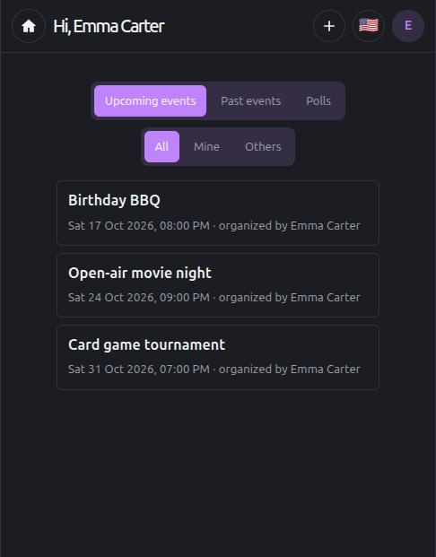
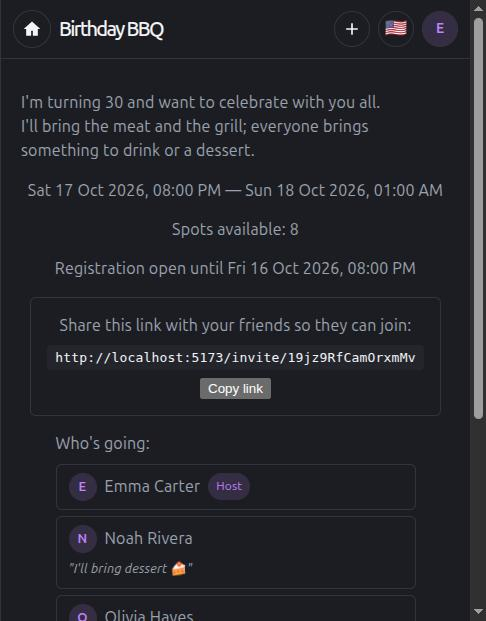
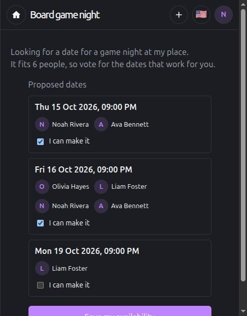

# Prendete

Plan things with friends without the back-and-forth: create an event, share a link and see who's coming. If there's no date yet, start a poll and let everyone vote.

**Live at [prendete.ar](https://prendete.ar)** · A personal project built with FastAPI, React and PostgreSQL. The app is available in English and Spanish.

<p align="center">
  
  
  
</p>

## Features

- **Events**: date, duration and description, location with search and map, attendee limit and registration deadline. Every event has its own invite link (which can be regenerated); whoever opens it joins with an optional comment. The host can edit and delete it, and clean up past events.
- **Date polls**: propose several dates, friends vote for the ones that work for them and everybody sees who voted for what. The host picks one and an event is created with the people who voted for that date. Polls can also be edited and deleted.
- **Accounts**: sign up with email and password (with email verification and password recovery) or with Google. Profile picture, and account deletion from the profile page.
- **Push notifications** (Web Push) when an event changes or is cancelled, or when a poll's date is confirmed. Each person turns them on for their own account.
- **Installable app** (PWA) in **English and Spanish**.
- **Admin dashboard** with usage metrics (total and new users and events, how many people signed up with a password and how many with Google), only for the emails listed in `ADMIN_EMAILS`.
- Terms of use and privacy policy.

## Stack

| Layer | Technologies |
| --- | --- |
| Backend | Python, FastAPI, SQLAlchemy 2.0, Alembic, PostgreSQL |
| Frontend | React 19, TypeScript, Vite, react-router, react-i18next |
| Auth | JWT + bcrypt, Google Sign-In (OIDC) |
| Integrations | Web Push (VAPID), Brevo (transactional email), Google Maps |
| Infrastructure | Render (API and static site), Neon (Postgres), Cloudflare (DNS) |
| Quality | pytest (180+ tests against a real Postgres database), TypeScript type checking |

## Technical decisions worth a look

- **Built to run on free tiers.** The Render backend goes to sleep after 15 minutes without traffic, and the Neon database closes its connections when it suspends. To hide that, an external cron keeps the backend awake, the frontend asks it to wake up as soon as it loads and retries instead of showing false errors while it boots, and SQLAlchemy uses `pool_pre_ping` to reopen dead connections. The details, including what did **not** work, are in [DEPLOY.md](DEPLOY.md) (written in Spanish).
- **Google login verified on the server.** The frontend receives an `id_token` (OIDC flow with `state` and `nonce`) and the backend validates it, requires a verified email, and wipes the existing password if the account existed unverified, to prevent a *pre-hijacking* attack.
- **Tests against a real database.** Tables are truncated between tests and the database is never mocked. Only external services (push and email) are mocked; real calls are never made.
- **Encrypted, tested backups.** A daily dump taken with a read-only role, checked with `pg_restore --list` and encrypted with [age](https://github.com/FiloSottile/age) before it leaves the machine. They live in a separate private repository, and a full restore has been tested.
- **Endpoints that act on the caller's own resource** (`/users/me`, `/events/{id}/attendance`), with no IDs in the path for things only the authenticated user can do.
- **Push per user, not per browser.** A browser keeps a single subscription shared by every user who logs in on that device, so the UI asks the backend who it belongs to before showing its state.

## Structure

```
app/         API: routers, SQLAlchemy models, schemas, push and email logic
alembic/     Migrations
tests/       pytest
frontend/    React + Vite + TypeScript
docs/        Design notes and screenshots
```

Built with Claude Code as a programming assistant; [CLAUDE.md](CLAUDE.md) (in Spanish) holds the project conventions.

## Local development

Everything below is for running the project on your own machine.

## Backend — Setup

```bash
python3 -m venv .venv
source .venv/bin/activate
pip install -r requirements.txt
cp .env.example .env
```

Edit `.env` and generate your own `SECRET_KEY`:

```bash
python3 -c "import secrets; print(secrets.token_hex(32))"
```

Generate the VAPID key pair for push notifications (once only — see [Push notifications](#push-notifications)):

```bash
python3 -c "
from py_vapid import Vapid02
from cryptography.hazmat.primitives.serialization import Encoding, PublicFormat
import base64

v = Vapid02()
v.generate_keys()

def b64url(b):
    return base64.urlsafe_b64encode(b).rstrip(b'=').decode()

priv_raw = v.private_key.private_numbers().private_value.to_bytes(32, 'big')
pub_raw = v.public_key.public_bytes(Encoding.X962, PublicFormat.UncompressedPoint)
print('VAPID_PUBLIC_KEY=' + b64url(pub_raw))
print('VAPID_PRIVATE_KEY=' + b64url(priv_raw))
"
```

## Database

Start Postgres with Docker:

```bash
docker compose up -d
```

Apply the migrations:

```bash
alembic upgrade head
```

## Run the API

```bash
uvicorn app.main:app --reload
```

Interactive docs at `http://localhost:8000/docs`.

## Sample data

`scripts/seed_data.py` **deletes** every existing user, event and attendee and loads 10 dummy users with 10 past and 10 upcoming events (each with a random group of attendees). For development only, never against production:

```bash
python scripts/seed_data.py
```

All users share the password `password123`; `demo@example.com` is a good account to explore (it has a mix of its own events and other people's events it attends). The sample event titles and locations are in Spanish.

## Authentication

Every route requires a JWT except the public ones: sign-up (`POST /users`), the auth endpoints (login, Google login, email verification, password reset), the invite previews (`GET /events/invite/{token}` and `GET /event-polls/invite/{token}`), avatars (`GET /users/{id}/avatar`) and `GET /health`.

```bash
# sign up
curl -X POST localhost:8000/users -H "Content-Type: application/json" \
  -d '{"email":"a@a.com","first_name":"Ana","last_name":"Lopez","password":"secret123"}'

# log in (form-urlencoded, username = email)
curl -X POST localhost:8000/auth/login \
  -d "username=a@a.com&password=secret123"

# use the token
curl localhost:8000/users/me -H "Authorization: Bearer <access_token>"
```

In `/docs`, use the "Authorize" button with the same email and password.

## Endpoints

### Users

- `POST /users` (public) — sign-up (`email`, `first_name`, `last_name`, `password`; optional `language` and `avatar_base64`, either bare base64 or a data URL). The avatar is decoded, validated as a real image, center-cropped to a square, resized to 256x256 and re-compressed as JPEG before it is stored (`app/utils/avatar.py: process_avatar`) — the crop and size the client sends are never trusted. `422` if it isn't a valid image or is larger than 8 MB once decoded.
- `GET /users`, `GET /users/me`, `GET /users/{id}` — include `avatar_url` (`/users/{id}/avatar`) or `null` if the user has no picture.
- `PATCH /users/me` — edits your own name, language and/or picture. Every field is optional and independent: `first_name`/`last_name`, `language`, `avatar_base64` (replaces the picture, same processing and validation as at sign-up) and `remove_avatar: true` (removes the current picture). Sending `avatar_base64` together with `remove_avatar: true` makes no sense — `remove_avatar` wins.
- `PATCH /users/me/password` — changes your password (needs the current one).
- `DELETE /users/me` — deletes your account and everything that hangs from it.
- `GET /users/{id}/avatar` (public, no login) — returns the raw JPEG. It needs no auth on purpose because it is used from `` (header, profile, attendee list), which never sends the JWT.
- `POST /users/me/push-subscriptions` — saves the current browser's push subscription (`endpoint` + `keys.p256dh`/`keys.auth`, the same shape the browser's `PushSubscription.toJSON()` returns). If the `endpoint` already exists it updates the `user_id` and keys instead of duplicating — so if two different users subscribe from the same browser, the row is reassigned to whoever subscribed last.
- `GET /users/me/push-subscriptions` — the endpoints registered for the current user.
- `DELETE /users/me/push-subscriptions?endpoint=...` — removes that subscription.

### Auth

- `POST /auth/login` (public).
- `POST /auth/google` (public) — signs in with a Google `id_token` plus the `nonce` the frontend generated; creates the account if it doesn't exist.
- `POST /auth/verify-email`, `POST /auth/resend-verification` — email verification. Confirming answers `400` for an invalid or expired token.
- `POST /auth/password-reset/request`, `POST /auth/password-reset/confirm` — password recovery. Requesting it (like resending the verification) always answers `204` whether or not the email has an account, so it can't be used to find out who is registered.

### Events

- `POST /events` (the owner is the authenticated user; requires `starts_at` and `duration_minutes`; `location`, `location_details`, `maps_link`, `max_attendees` and `registration_deadline_minutes_before` are optional). `422` if `starts_at` is already in the past, or if with the chosen `registration_deadline_minutes_before` registration would already be closed at creation time (validated in `EventCreate.validate_start_and_registration_window`, `app/schemas/event.py`).
- `GET /events` — your own events plus the ones you attend (it does not list every event in the system), ordered by `starts_at` ascending (soonest first); each event includes `owner_name`.
- `GET /events/{id}` — only the owner or an accepted attendee (404 for everybody else).
- `PATCH /events/{id}` — edits the event (same fields and validations as `POST /events`); owner only, and only if the event hasn't started yet (`403` once it has). `422` if the new `max_attendees` would fall below the number of attendees already accepted.
- `DELETE /events/{id}` — owner only (`403` otherwise). A past event can be deleted too, to clean up the history: in that case nobody is notified and the poll that produced it (if any) is deleted with it, because otherwise that poll would show up again as pending with expired dates. If the event hasn't started yet, attendees get a push notification and the originating poll is reopened.

### Invite links and attendees

The model is deliberately simple: a row in `attendees` (`app/models/attendee.py`) means "this user is going to this event", with no intermediate states (there is no `pending`/`declined` — that existed in an earlier version and was simplified away). Joining creates the row, leaving deletes it outright and frees the spot immediately.

- `GET /events/{event_id}/invite-link` (owner only) — returns the `invite_token` used to build the link to share.
- `POST /events/{event_id}/invite-link/regenerate` (owner only) — invalidates the previous link and generates a new one.
- `GET /events/invite/{invite_token}` (public, no login) — event preview and remaining spots, to show before asking for login or sign-up.
- `POST /events/invite/{invite_token}/join` (authenticated) — joins the event; optional body `{"comment": "..."}` (max 500 characters) that the owner sees in the attendee list; `409` if already joined, if the event is full, or if the registration deadline has passed (`registration_deadline_minutes_before`, or the event's start time if none was set).
- `PATCH /events/{event_id}/attendance` — updates your own comment; `404` if you aren't attending the event.
- `DELETE /events/{event_id}/attendance` — **leave the event**: deletes your attendee row and frees the spot immediately; `403` if you are the owner (that's what `DELETE /events/{id}` is for), `404` if you weren't attending.
- `GET /events/{event_id}/attendees` (owner or attendee) — list for the frontend: owner first (`is_owner: true`), then each attendee ordered by `joined_at` (the order they joined), with name and email. The `comment` each person left when joining is only returned if the requester is the event's owner or the comment's own author; for everybody else it is `null`.

### Date polls

- `POST /event-polls` — creates a poll with at least two future dates (`date_options`); `GET /event-polls` lists the polls you own or voted in that haven't been resolved yet.
- `GET /event-polls/{id}` — the poll with who voted for each date (owner, or someone who voted).
- `PATCH /event-polls/{id}` — owner only, while the poll is unresolved. A date that is kept keeps its votes; a date that is removed loses them. Optionally notifies the people who already voted.
- `DELETE /event-polls/{id}` — owner only; notifies the voters if the poll was still open.
- `GET /event-polls/invite/{token}` (public) — the proposed dates; voter names are only included for a logged-in viewer. `POST /event-polls/invite/{token}/vote` casts your votes through the link.
- `PUT /event-polls/{id}/date-options/votes` — replaces your votes. `GET /event-polls/{id}/invite-link` and `POST .../invite-link/regenerate` (owner only) work like the event ones.
- `POST /event-polls/{id}/resolve` — the owner links the poll to an event they created and a chosen date: the people who voted for that date are added as attendees and everybody who voted is notified.

### Admin

- `GET /admin/stats` — totals and new users and events over the last day, week and month, plus the split between password and Google accounts. Requires the email to be listed in `ADMIN_EMAILS` and verified.

## Tests

```bash
pytest
```

They use a separate database (`prendete_test`, in the same Postgres) that is created automatically if it doesn't exist, and the tables are truncated before every test. They never touch the development database.

## New migrations

```bash
alembic revision --autogenerate -m "description"
alembic upgrade head
```

## Frontend — Setup

```bash
cd frontend
npm install
cp .env.example .env
npm run dev
```

It runs at `http://localhost:5173`. The backend must be running at `http://localhost:8000` (CORS is already configured for that origin in `app/main.py`).

`VITE_GOOGLE_MAPS_API_KEY` in `.env` is needed to set a location when creating an event — without it the rest of the app works, but the "Location" field is disabled (see "Location with Google Maps" below; there is no manual way to enter one). To get one:

1. [console.cloud.google.com](https://console.cloud.google.com) → new project → enable billing (Google asks for a card, even for usage that stays within the free quotas).
2. Enable, each one separately: **Maps JavaScript API** (it may be listed as "Dynamic Maps" in the API search), **Places API (New)**, **Maps Embed API**.
3. Credentials → create an API key.
4. Restrict it: by "HTTP referrers" to your domain (`localhost:5173/*` in dev), and by "API restrictions" to the three above.
5. Paste it into `frontend/.env` as `VITE_GOOGLE_MAPS_API_KEY=...`.

`VITE_VAPID_PUBLIC_KEY` in `.env` has to be the same `VAPID_PUBLIC_KEY` you configured in the backend (see "Push notifications" below) — if it doesn't match, `pushManager.subscribe()` fails in the browser.

Optionally, `VITE_GOOGLE_CLIENT_ID` (and `GOOGLE_CLIENT_ID` in the backend) enable the "Continue with Google" button; while they are empty the button is hidden.

Pages:

- `/login`, `/register`, `/forgot-password`, `/reset-password/:token`, `/verify-email/:token` — public.
- `/auth/google/callback` — public, where Google sends you back after signing in.
- `/privacy`, `/terms` — public.
- `/invite/:token` and `/polls/invite/:token` — public previews of an event or a poll; if there is no session they ask for login or sign-up and come back here afterwards.
- `/` — protected, redirects straight to `/events`.
- `/events` — protected, your main screen: all your events (your own and the ones you attend) and your polls, with combinable filters.
- `/events/new`, `/events/:eventId/edit` — protected, the create and edit form.
- `/events/:eventId` — protected, event detail; if you are the owner it shows the invite link to share.
- `/polls/new`, `/polls/:pollId/edit`, `/polls/:pollId` — protected, the same for polls.
- `/profile` — protected, your name, email, picture, password and notification settings.
- `/admin` — protected, usage dashboard for admins.

All pages share a fixed header at the very top (`components/Header.tsx`, mounted once in `App.tsx`): on the left a round button with a house icon that goes to `/` (which in turn redirects to `/events`); in the middle the large title of the current page (each page sets it with `usePageTitle` from `context/PageTitleContext.tsx` — dynamic for pages like the event detail, which shows the event's real name instead of fixed text; on `/events` it shows a greeting instead of a generic title); and on the right a "+" menu to create an event or a poll, the language selector (flag of the active language) and, when logged in, a round icon with the user's initial that opens "My profile" / "Log out" on hover or click (`components/LanguageSwitcher.tsx`, `components/AccountMenu.tsx`, coordinated by `context/TopBarMenuContext.tsx` so only one is open at a time). There is no sidebar or side navigation — the whole app hangs from that header.

`/events` (`pages/Events.tsx`) combines two independent filters, both using the same reusable `components/SegmentedFilter.tsx`:
- **By date** (Upcoming events / Past events / Polls) — computed on the client by comparing `starts_at` with the current time; upcoming events sort ascending (soonest first), past events sort descending (most recent first).
- **By organizer** (All / Mine / Others) — compares `event.owner_id` with the logged-in user.

Both filters combine without changing the order of the list.

The JWT is stored in `localStorage`. If it expires or stops being valid (for example a tab was left open with the old session), the first authenticated request that fails with `401` clears the token and redirects to `/login` automatically (`api/client.ts: request`) — the app is never left running with actions that fail silently.

### Duration and registration deadline

The create form asks for a start date + **duration in hours** (not an end date); the end time is computed and shown in the detail and preview ([api/events.ts](frontend/src/api/events.ts): `endsAt`). The "Registration deadline" is optional (in hours before the event) — **if left empty, it defaults to the event's start time**: nobody can join once the event has started, even if the owner never configured an explicit deadline (`crud.event.is_registration_open`). After the deadline, `POST .../join` returns `409`, and on the invite preview the "Join" button disappears and a live countdown (`HH:MM:SS`, or `Xd HH:MM:SS` if 24 hours or more remain) is shown until the deadline.

### Location with Google Maps

The "Location" field of the create form **is** the Google Maps search (`components/LocationSearch.tsx`) — there is no way to paste a link by hand, and no separate link field. It requires `VITE_GOOGLE_MAPS_API_KEY` in `frontend/.env`, with Maps JavaScript API + Places API (New) + Maps Embed API enabled in the Google Cloud project (see "Frontend — Setup" above); if the key is missing or loading fails, the field is disabled and shows an error — there is no free-text fallback.

Live autocomplete while typing (Places API New — `AutocompleteSuggestion`, grouped into sessions with `AutocompleteSessionToken` for billing). When a result is chosen, the place's details are requested (`Place.fetchFields`) and with the exact `place_id` an embeddable link is built directly: `https://www.google.com/maps/embed/v1/place?key=...&q=place_id:<id>` (`utils/googleMaps.ts: buildEmbedUrl`), which is stored as-is in `maps_link` — the backend no longer transforms or validates that field, it trusts the frontend to always send a real embeddable link. The pin is exact (it comes from the `place_id`, not from coordinates parsed out of a URL) and carries the real name of the place.

If after choosing a result the user edits the "Location" text by hand, the stored link is discarded (so a map that no longer matches the text is never saved) — the event keeps that location as free text, with no embedded map.

Detecting whether an already stored `maps_link` is embeddable is still automatic on the frontend ([utils/maps.ts](frontend/src/utils/maps.ts)) when the event is displayed. If no place is chosen, the event has no map.

### Profile picture

On `/register`, `components/AvatarPicker.tsx` lets you pick a picture (optional): it opens the native file picker, and with [react-easy-crop](https://github.com/ValentinH/react-easy-crop) shows the whole image with a circular mask and zoom to crop it. On confirming, the crop is extracted to a 256x256 `<canvas>` and compressed to JPEG (`utils/image.ts: cropImageToDataUrl`) before being sent as `avatar_base64` to the backend, which validates and normalizes everything again (see the Endpoints section). When the user has a picture it replaces the initial in the account circle of the header (`components/AccountMenu.tsx`), appears larger on `/profile`, and shows before the name in an event's attendee list (`components/Avatar.tsx`, used in `EventDetail.tsx`). With a Google account, the Google profile picture is imported on first sign-in.

On `/profile`, the "Edit profile" button turns into a form (the same `AvatarPicker`, preloaded with the current picture) to change the name and/or picture — it calls `PATCH /users/me` and updates the user in `AuthContext` instantly (without reloading the page), so the header and the rest of the app reflect the change right away.

### Edit and delete events

On `/events/:id`, the owner always sees the "Delete event" button, and "Edit event" only while the event hasn't started (`event.starts_at` in the future); once it has started, editing and the invite link stop being shown (nobody can join anymore), but the owner can still delete the event. "Edit event" goes to `/events/:id/edit`, which reuses the same form and component as `CreateEvent.tsx` (including the location search) preloaded with the current data and calls `PATCH /events/{id}` instead of `POST /events`. "Delete event" opens a confirmation popup (`components/ConfirmModal.tsx`: Cancel / Yes, delete) before calling `DELETE /events/{id}` and going back home. The backend validates editing server-side as well as hiding it in the frontend (owner and event not started; `PATCH` answers `403` if it already started), and `PATCH` also rejects lowering `max_attendees` below the number of attendees already accepted.

Polls work the same way: "Edit poll" and "Delete poll" on `/polls/:id`, with the same form and the same confirmation popup. When editing a poll that already has votes, the form warns that removing or changing a date deletes its votes, and asks whether to notify the voters.

### Leave an event

On `/events/:id`, someone who attends and isn't the owner sees the "Leave event" button (the same confirmation popup, `ConfirmModal`, as "Delete event"). It calls `DELETE /events/{event_id}/attendance`, which deletes the `attendees` row outright — no record is left that you attended, and the spot is freed immediately for someone else to join. It then redirects you home. The owner never sees this button: to delete their own event there is "Delete event".

On that same row, an attendee can also edit their own comment ("Edit comment" / "Add comment" if they hadn't left one) — it opens the same kind of textarea as when first joining and calls `PATCH /events/{event_id}/attendance`. Nobody else can edit somebody else's comment: the endpoint only acts on the authenticated user's own `attendees` row.

### Push notifications

When the owner edits or deletes an event, each attendee (not the owner) receives a browser push notification — "Event updated" / "Event cancelled" — without needing the app to be open. Poll participants are notified too, when a poll is edited, deleted or resolved.

**How it works:**
- The browser registers a service worker (`frontend/public/sw.js`) that listens for the `push` event and shows the notification; clicking it focuses or opens the app on the matching event.
- On `/profile`, the "Enable notifications" / "Disable notifications" button asks the browser for permission (`Notification.requestPermission()`) and, if granted, creates a `PushSubscription` (`pushManager.subscribe`, `api/push.ts`) that is saved in the backend through `POST /users/me/push-subscriptions`.
- When an event is edited (`PATCH /events/{id}`) or deleted (`DELETE /events/{id}`), the backend collects the attendees' `user_id`s *before* applying the change (on delete, the cascade takes the `attendees` rows with it), applies the change (commit) and only then sends a push to each one with `app/push.py: send_push_to_users`, using [`pywebpush`](https://github.com/web-push-libs/pywebpush) + the VAPID keys. It is sent synchronously inside the same request — there is no message queue, which is enough at this scale.
- `send_push_to_users` catches **any** exception when pushing to one user (not just `WebPushException` — a timeout or network error talking to the push service raises something else) and carries on with the rest: since the event change was already committed before this loop, a network failure while sending push should never (a) stop the remaining attendees from being notified, nor (b) return a 500 to the owner for an action that actually worked.
- Sending passes `ttl=PUSH_TTL_SECONDS` (3 days) explicitly — `pywebpush` sends `ttl=0` by default, which tells the push service "deliver this only if the device is online right now, otherwise drop it". Without this parameter, someone without internet at the exact moment of sending would silently lose the notification instead of receiving it on reconnecting.
- If someone's browser invalidated their subscription (they uninstalled it or cleared the site's data), the push service answers `404`/`410` and that `push_subscriptions` row is deleted automatically — it is neither retried nor left behind as garbage.

**Independent of the session**: sending the push doesn't go through the app's authenticated API — it goes from the backend straight to the browser's push service (FCM, etc.) using the stored `endpoint`. If the recipient's JWT has expired, they still get the notification; the JWT is only needed at the moment of enabling or disabling (those are authenticated requests).

**Multi-device**: each device/browser has its own `PushSubscription` — it is inherent to Web Push, there is no way to "propagate" a subscription between devices. Enabling it on the phone doesn't enable it on the computer; you have to enable it on each one. The backend already supports this with no changes: there is no one-row-per-user restriction in `push_subscriptions`, so `send_push_to_user` sends to every subscription of that user (one per enabled device).

**Multiple users in the same browser**: the browser only keeps **one** `PushSubscription` per origin — it isn't per logged-in user, it belongs to the device/browser profile. If two people share the same browser, only the one who enabled notifications most recently can receive them there; this is a real limitation of the Push API, not something that can be fully avoided.

What we do avoid is the bug that follows from it: previously, both the activation popup and the `/profile` button only checked whether the browser *had* a subscription (`pushManager.getSubscription()`), without verifying whose it was. So if user A enabled notifications and then user B logged in on the same device, B saw "already enabled" without ever having enabled them — because the browser's subscription was still there, but in the database it still pointed to A. Now `getMyPushSubscription()` (`api/push.ts`) also calls `GET /users/me/push-subscriptions` to confirm that the `endpoint` is registered under the current user before saying they are enabled; if not, it is treated as "not enabled for me" and the popup/button is offered again. The popup also stores its "no, thanks" mark per user (`push_prompt_dismissed_<user_id>`), not globally, so one user's refusal doesn't hide the popup for another who shares the device.

If B decides to enable in that state, `POST /users/me/push-subscriptions` upserts by `endpoint` and reassigns the row to B — from then on B receives the pushes on that device, and A stops receiving them there (A still receives them on any other device where they enabled it). This is the expected behavior given there can only be one active owner per browser subscription.

**Activation popup after login** (`components/NotificationPrompt.tsx`): instead of asking for the browser's native permission as soon as the user logs in (bad practice — a "surprise" prompt with no context has a very low acceptance rate, and if it is refused the site can never ask again unless the person goes into the browser settings by hand), it shows its own modal (same style as `ConfirmModal`: overlay + centered box, closes by clicking outside) the first time a device has no active subscription:
- **Android/desktop**: asks directly "Want to get notified when your events change?" with Enable / No, thanks. The real native permission prompt is only triggered if the user says yes.
- **iPhone (Safari or any other WebKit browser)**: push **doesn't work at all** in a regular tab — Apple requires the site to be added to the home screen (an installed PWA) to enable it. The modal detects this (`utils/platform.ts: isIos` + `isStandalone`, comparing `display-mode: standalone` and the legacy `navigator.standalone`) and instead of asking for permission shows instructions ("tap Share → Add to Home Screen"). Once it is added and reopened from the icon (which does run in standalone mode), the modal goes back to the normal question about enabling notifications.
- Choosing "No, thanks" (or closing by clicking outside) on the question saves a mark in `localStorage` so it isn't asked again; the iOS instructions modal doesn't save that mark (it can be shown again on future visits while the app is still not installed, without being as insistent since it isn't the real native prompt).
- For "Add to Home Screen" to look right (its own icon, no browser address bar) `frontend/public/manifest.json` + `apple-touch-icon` in `index.html` are needed — both are in place.

**Setup**: you need a VAPID key pair (see "Backend — Setup" above for the command) loaded as `VAPID_PUBLIC_KEY`/`VAPID_PRIVATE_KEY`/`VAPID_CONTACT_EMAIL` in the backend's `.env`, and the same `VAPID_PUBLIC_KEY` as `VITE_VAPID_PUBLIC_KEY` in the frontend's `.env`.

## Not done yet

- Refresh tokens / server-side logout (the current JWTs expire on their own, there is no revocation).
- Changing the email from `/profile` (`PATCH /users/me` only updates the name, language and picture, not the email).
- The owner of an event can't remove a guest from the list.
